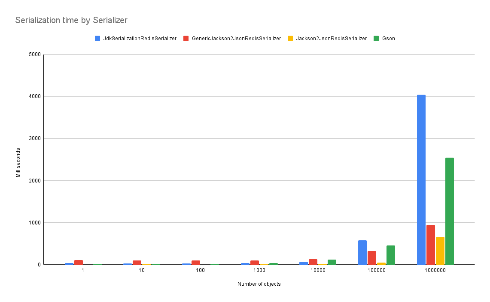
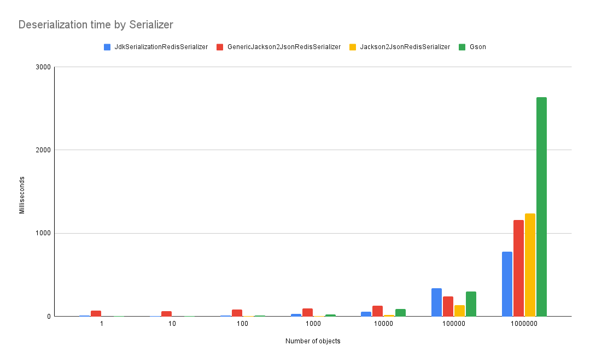
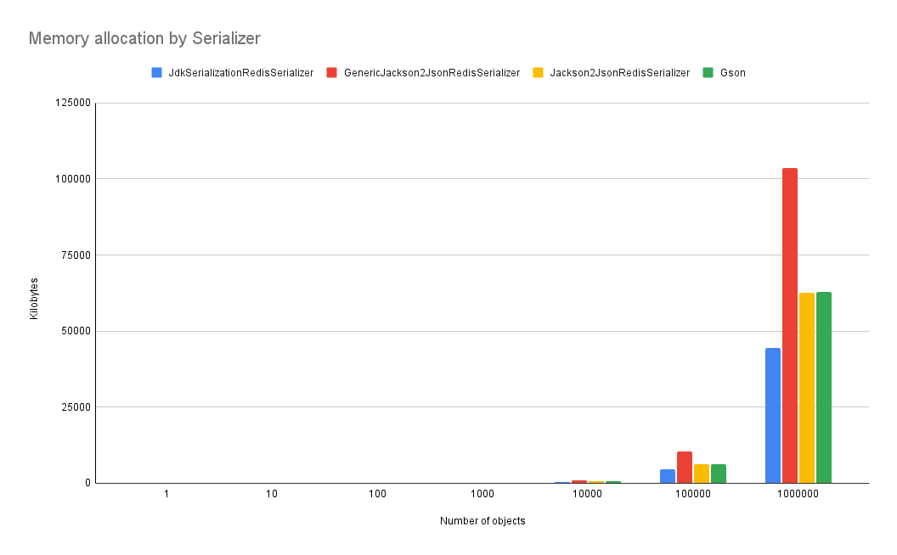

# RedisSerializer tests
While playing with RedisSerializer, I decided to test a bit the performance of the available serializers, such as:
* JdkSerializationRedisSerializer
* GenericJackson2JsonRedisSerializer
* Jackson2JsonRedisSerializer
* Gson

# Pro-Tips
1. There is no short answer saying which one is better, unfortunately, as usual, it depends on your use case.
2. JdkSerializationRedisSerializer is the default RedisSerializer used by the RedisCacheManager.

# The test
The test I made is about serializing/deserializing a basic object like a Movie which has just 3 attributes: title, rating and year.

```java
public class Movie implements Serializable {

    private long id;
    private String title;
    private int rating;
    private int year;

    public Movie() {
    }

    public Movie(String title, int rating, int year) {
        this.title = title;
        this.rating = rating;
        this.year = year;
    }
    
    // Getters and Setters
}
```

So, just primitive types, no nested objects, nor lists, nor maps.

And to have some "fun", I used the JavaFaker library to generate the title of the movie - also to avoid as much as possible JIT literal caching.

The test has the following iterations to create the exact amount of objects:
* 1
* 10
* 100
* 1.000
* 10.000
* 100.000
* 1.000.000

So, during last iteration 1 million Movie objects will be serialized and deserialized at once.

# Serialization
During the iterations I collected all data, and here is what I found in regard to Serialization time (expressed in milliseconds):

| Movie | Preparation Time | JdkSerializationRedisSerializer | GenericJackson2JsonRedisSerializer | Jackson2JsonRedisSerializer | Gson |
|------:|-----------------:|--------------------------------:|-----------------------------------:|----------------------------:|-----:|
|1|231|40|112|1|14|
|10|377|25|99|3|22|
|100|1.014|30|99|2|20|
|1.000|4.941|36|101|4|34|
|10.000|14.409|67|132|18|117|
|100.000|138.382|580|321|49|452|
|1.000.000|1.299.791|4.045|950|659|2.546|

And a better view on a Column Chart:



## Analysis
From my understanding, as long as you have a few objects to serialize, I would use any serializer except for the GenericJackson2JsonRedisSerializer.
Serializing one object or 10 thousands, it takes more or less the same amount of time.

Things start to change when we reach the 100.000 objects to serialize. The GenericJackson2JsonRedisSerializer is now second in performance, the best one is his brother Jackson2JsonRedisSerializer.
The JdkSerializationRedisSerializer and Gson serializers are worst in performance by a x10 and x5 respectively.  
The best in performance is the Jackson2JsonRedisSerializer, which goes from few milliseconds just above half second in the last iteration (659 ms). 

# Deserialization
During the iterations I collected all data, and here is what I found in regard to Deserialization time (expressed in milliseconds):

| Movie | Preparation Time | JdkSerializationRedisSerializer | GenericJackson2JsonRedisSerializer | Jackson2JsonRedisSerializer | Gson |
|------:|-----------------:|--------------------------------:|-----------------------------------:|----------------------------:|-----:|
|1|231|9|72|1|5|
|10|377|5|61|1|6|
|100|1.014|9|81|4|9|
|1.000|4.941|31|100|5|23|
|10.000|14.409|57|130|21|91|
|100.000|138.382|340|244|135|298|
|1.000.000|1.299.791|782|1.159|1.241|2.638|

And a better view on a Column Chart:



## Analysis
Results here are a bit different. However, the GenericJackson2JsonRedisSerializer is still performing poorly until the very last iteration, where it actually performs as the second best.
Jackson2JsonRedisSerializer performs very well at each iteration, but it's not the winner. Up to the second last iteration it's way better than its competitor performing between x2 and x3 times faster.
In the last iteration everything changes.
JdkSerializationRedisSerializer is the best performer, almost x2 times faster than the GenericJackson2JsonRedisSerializer and Jackson2JsonRedisSerializer, and more than x3 times faster than the Gson serializer.

# Memory footprint
During the iterations I collected all data, and here is what I found in regard to memory footprint (expressed in bytes):

| Movie | Preparation Time | JdkSerializationRedisSerializer | GenericJackson2JsonRedisSerializer | Jackson2JsonRedisSerializer | Gson |
|------:|-----------------:|--------------------------------:|-----------------------------------:|----------------------------:|-----:|
|1|231|201|137|72|72|
|10|377|586|1.053|619|619|
|100|1.014|4.679|10.456|6.332|6.357|
|1.000|4.941|44.748|103.625|62.601|62.951|
|10.000|14.409|444.749|1.034.626|624.602|627.587|
|100.000|138.382|4.447.901|10.347.778|6.247.754|6.277.299|
|1.000.000|1.299.791|44.482.877|103.482.754|62.482.730|62.770.590|

And a better view on a Column Chart:



## Analysis
The GenericJackson2JsonRedisSerializer is the worst in memory allocation, except in the first iteration with 1 object. However, its memory allocation is x2 times bigger than Jackson2JsonRedisSerializer and Gson ones.
The Jackson2JsonRedisSerializer and Gson serializers are pretty much identical for memory allocation during all iterations.
The JdkSerializationRedisSerializer is the best performer, due to its binary format in representing the serialized object.


# Pro-Tip
1. As you can see from my "analysis", I'm not a data scientist.  
2. Keep an eye on the amount of data that you have to serialize/deserialize and choose your serializer wisely.

# Output representations

## JdkSerializationRedisSerializer

```shell
Sorry I couldn't use text representation, because its binary characters break MarkDown rendering.
```

## GenericJackson2JsonRedisSerializer
```json
["java.util.ArrayList",[{"@class":"com.foogaro.data.models.Movie","id":0,"title":"The Other Side of Silence","rating":1,"year":1959}]]
```

## Jackson2JsonRedisSerializer
```json
[{"id":0,"title":"The Other Side of Silence","rating":1,"year":1959}]
```

## Gson
```json
[{"id":0,"title":"The Other Side of Silence","rating":1,"year":1959}]
```


